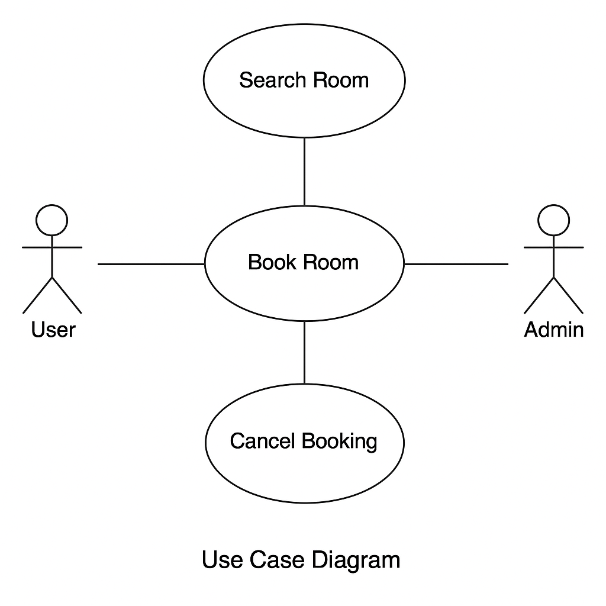

# Requirement Analysis in Software Development

## Introduction
This repository explores the essential process of requirement analysis in software development. It highlights its role in the SDLC, key activities involved, and includes diagrams and examples related to a booking management system.

---

## What is Requirement Analysis?
Requirement Analysis is the process of identifying, documenting, and managing the needs and expectations of stakeholders for a software system. It serves as the foundation for successful project planning and implementation in the SDLC. Without clear requirements, software projects often suffer from miscommunication, scope creep, and failures in functionality.

---

## Why is Requirement Analysis Important?
1. **Clear Communication**  
   It bridges the gap between stakeholders and developers by clearly outlining expectations.

2. **Prevents Costly Errors**  
   Identifying requirements early avoids rework, reducing cost and development time.

3. **Improves Quality**  
   Well-analyzed requirements ensure the final product meets both functional and business goals.

---

## Key Activities in Requirement Analysis
- **Requirement Gathering**: Collecting requirements from stakeholders via interviews, surveys, etc.
- **Requirement Elicitation**: Understanding the true needs behind stakeholder requests.
- **Requirement Documentation**: Recording requirements clearly in documents like SRS.
- **Requirement Analysis and Modeling**: Structuring and analyzing requirements to ensure feasibility.
- **Requirement Validation**: Confirming that documented requirements align with business goals.

---

## Types of Requirements

### Functional Requirements
These define what the system should do.  
**Example (Booking Management Project):**
- A user can search for available hotel rooms.
- A user can book and cancel a reservation.
- An admin can manage room inventory.

### Non-functional Requirements
These specify how the system performs.  
**Example (Booking Management Project):**
- The system must load booking pages within 2 seconds.
- The platform must be available 99.9% of the time.
- Data must be encrypted during transmission.

---

## Use Case Diagrams

**What are Use Case Diagrams?**  
Use Case Diagrams visually represent how users (actors) interact with the system. They help identify system functionality and user roles.

**Benefits:**
- Clarifies user roles and system scope.
- Helps in communicating functional requirements.
- Useful in test case creation.

---

## Acceptance Criteria

**Definition:**  
Acceptance Criteria are conditions that a software feature must satisfy to be accepted by a user or customer. They ensure that the development team understands when a requirement is complete and acceptable.

**Example (Checkout Feature):**
- The user can review their booking summary.
- The user must enter valid payment information.
- The system sends a confirmation email after payment.
- If payment fails, the user sees an error message and can retry.

# requirement-analysis
